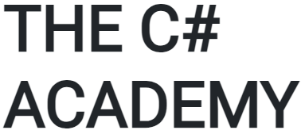

# .NET Full-Stack Developer

My progress in the [**The C# Academy**](https://www.thecsharpacademy.com) course.

## Foundations :heavy_check_mark:

- [x] Start Here
- [x] Getting Help
- [x] Setting Up
- [x] C# Foundations

## Console

### Beginner

- [ ] Free Code Camp C# Certification
- [ ] Math Game
- [ ] Calculator
- [ ] Habit Logger
- [ ] Coding Tracker

### Intermediate

- [ ] Flashcards
- [ ] Drinks Info
- [ ] Phone Book
- [ ] Shifts Logger

### Advanced

- [ ] Exercise Tracker
- [ ] Sports Results Notifier
- [ ] Excel Reader
- [ ] Unit Testing

## Apply For Jobs

- [ ] Portfolio
- [ ] Resume

## Full Stack Development

### MVC

- [ ] Water Drinking Logger
- [ ] Movies
- [ ] Todo List
- [ ] Budget

### React

- [ ] Tic-Tac-Toe
- [ ] Call an External API
- [ ] Shopping List
- [ ] Friends Manager

### Angular

- [ ] Tour of Heroes
- [ ] Coffee Tracker
- [ ] Sleep Tracker
- [ ] Quiz Game

### Blazor

- [ ] Wardrobe Inventory
- [ ] Memory Game
- [ ] Food Journal
- [ ] Sports Statistics

### MAUI

- [ ] Math Game
- [ ] Books to Read
- [ ] Monkeys Data
- [ ] Warehouse Admin

## Auth Area

- [ ] Authentication and Authorization
- [ ] Product Management System
- [ ] External Auth

## Cloud Development

- [ ] Deploying a Simple App
- [ ] Deplyoing a full-stack .NET app
- [ ] Deploy a full-stack .NET + JS Framework app
- [ ] Azure Functions

## SQL Area

- [ ] Starter SQL Challenges
- [ ] Starter SQL Challenges 2
- [ ] Starter SQL Challenges 3

## Challenge Projects

- [ ] Brewery API